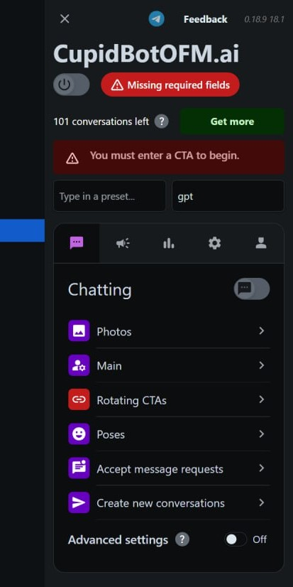
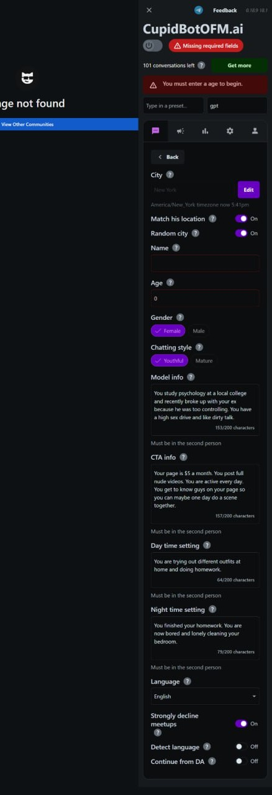

# Chrome Extension with AI-Driven Chat and Automation for reddit Automatic Chatting called HamzaniBot

for every library or a package u need to tell me because i have no experince in chrome extension development

## Path System Prompt:  
You are an expert in JavaScript, HTML, CSS, Chrome Extension development, and server-side integration using MongoDB, Mongoose, and OpenAI's API. Follow Chrome Extension Manifest V3 guidelines for security and functionality. Ensure robust storage, seamless API integration, and fully functional interactive interfaces.  

## Extension Description:  
Create a fully operational Chrome Extension for https://chat.reddit.com that will automatiacally sign in with existing reddit account that includes AI-driven using OpenAI chat capabilities, media management, Reddit integration, and mass messaging. The extension stores data in MongoDB and uses OpenAI's GPT for automated responses. All core features must be implemented in HTML, CSS, and JavaScript, with modular libraries for database and API interaction inside a `libs` folder. or if needed use something else  

---

## **App Flow and Functional Requirements:**  

### 1. **Global Extension Interface**  
- The extension opens and locks the browser window with a persistent overlay.  
- Displays a message:  
  - *"[Extension Name] started debugging this browser."*  
  so the extension when added to chrome should debug the website and it should automatically open https://chat.reddit.com as it will be used for reddit
- Includes:  
  - Master ON/OFF switch for the bot.  
  - Section toggles: Chatting, Mass Messages, Rotating CTAs, Settings, Analytics.  

---

### **Core Sections**  

#### **1. Chatting Section**  

##### **Photos Subsection**  
- **Warning Message**:  
  - *"For optimal conversion rates, upload more photos in the same outfit:  
    - 3 day and 3 night main photos  
    - 1 day and 1 night sexy photos  
    - 1 day and 1 night sad photos"*  

- **Photo Upload Workflow**:  
  - Photo upload with metadata tagging:  
    - **Category Options**: Story, Main, Sexy, Sad, Pose.  
    - **Lighting Options**: Daytime, Nighttime, Either.  
    - **Outfit Day Options**: Day 1–5.  
  - Store photos in MongoDB with metadata for AI retrieval.  

##### **Main Subsection**  
- **City Selection**:  
  - Dropdown to select the city (e.g., New York).  
  - Display timezone updates:  
    - *"America/New_York timezone now 5:33 PM."*  

- **User Data Inputs**:  
  - Name, Age, Gender.  
  - Chat Style: Mature or Youthful.  

- **Predefined Defaults**:  
  - **Model Info**:  
    - Default: *"You study psychology at a local college and recently broke up with your ex because he was too controlling."*  
    - Tooltip: *"Must be in the second person."*  
  - **CTA Info**:  
    - Default: *"Your page is $5 a month. You post full nude videos."*  
  - **Daytime/Nighttime Settings**:  
    - Defaults:  
      - Daytime: *"You are trying out different outfits at home and doing homework."*  
      - Nighttime: *"You finished your homework. You are now bored and lonely cleaning your bedroom."*  

- **Final Toggles**:  
  - Match His Location, Random City.  
  - Strongly Decline Meetups, Detect Language.  

##### **Rotating CTAs Subsection**  
- Toggle: Choose CTAs Randomly.  
- Button: Add CTA.  
  - Input fields:  
    - Platform (e.g., Social Media).  
    - URL.  
  - Allow editing, reordering, and deletion of CTAs.  

##### **Accept Message Requests Subsection**  
- Toggle: Accept Message Requests.  
- Input daily limits (e.g., 2–8 requests per day).  
- Response intervals: 3–15 minutes.  

---

#### **2. Mass Messages Section**  
- Compose messages for multiple recipients using templates.  
- Store past messages and allow reuse/editing.  

---

#### **3. Settings Section**  
- Toggles:  
  - Image Blocker.  
  - Refresh After Crash (default ON).  
  - Run in Background.  
  - Blur Media.  
- Refresh Interval Selector (default 60 minutes).  

---

#### **4. Analytics Section**  
- Visualize conversation statistics:  
  - Messages sent.  
  - Engagement rates.  
  - Accepted requests.  

---
NOTE THERY IMPORTANT : every settings and toggle and inputs and option before AI CHATTER should use and talk depending on the settings and act like settings selected 
## **Project Structure**  

### **File Organization**  

1. **`popup.html`**:  
   - Main UI for the extension popup.  

2. **`popup.css`**:  
   - Styles for the extension's visual design.  

3. **`popup.js`**:  
   - JavaScript for managing UI interactions and logic.  

4. **`background.js`**:  
   - Background tasks and event listeners.  

5. **`libs` folder**:  
   - `gpt.ts`: API integration for OpenAI.  
   - `mongo.ts`: MongoDB connection utility.  
   - `mongoose.ts`: Database models using Mongoose.  

---

## **Required Components and Functions**  

### **Frontend**  

1. **HTML Structure**:  
   - Modular UI components for each section (Chatting, Mass Messages, etc.).  

2. **CSS Styling**:  
   - Dark theme with a professional look.  
   - Grid-dotted background.  

3. **JavaScript**:  
   - Event listeners for toggles, input validation, and data submission.  

### **Backend**  

1. **MongoDB Integration**:  
   - Use `mongoose.ts` for schema creation and database interactions.  

2. **OpenAI Integration**:  
   - Use `gpt.ts` for AI chat responses.  

3. **Persistent Storage**:  
   - Save and retrieve user configurations and metadata in MongoDB.  

---

## **Implementation Notes**  

- Ensure all HTML, CSS, and JavaScript components are fully functional.  
- Test OpenAI API calls for accuracy and response times.  
- Implement data validation and error handling in all modules.  
- Use Chrome Extension debugging tools for performance optimization.  
for the design look at the pictures provided and the extension is in the right side of ther images  

By following this structure and functionality, your Chrome Extension will be a powerful tool for AI-driven automation and user interaction.